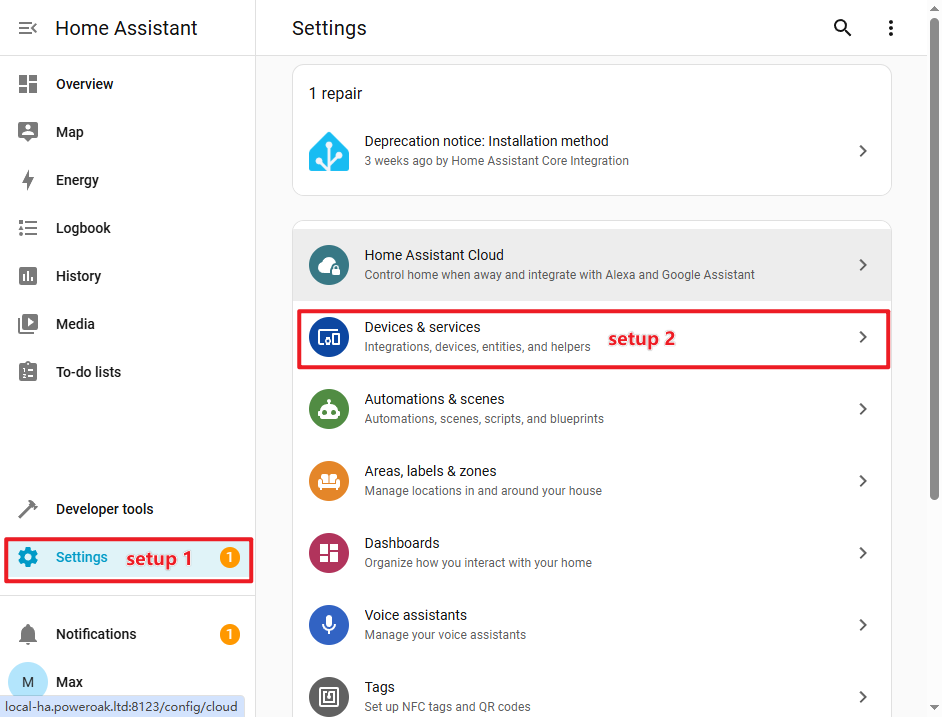

# BLUETTI Integration for Home Assistant

[🇨🇳 简体中文](./README_zh.md) | [🇩🇪 German](./README_de.md) | [🇬🇧 English](./README.md) | 
[🇳🇱 Dutch](./README_nl.md) | [🇺🇦 Ukrainian](./README_uk.md)

BLUETTI Power Station Integration is an integrated component of Home Assistant
supported by BLUETTI official. It allows you to use BLUETTI smart Power Station
devices in Home Assistant.

The Integration's github repository is:
[https://github.com/bluetti-official/bluetti-home-assistant](https://github.com/bluetti-official/bluetti-home-assistant).

## ✨ Features

- ✅ Power Switch
- ✅ Inverter Status
- ✅ Battery state of charge (SOC)
- ✅ AC Switch
- ✅ DC Switch
- ✅ Main unit power switch
- ✅ AC ECO
- ✅ DC ECO
- ✅ Work mode switch: Backup, Self-consumption, Peak and Off-Peak
- ✅ Sleep Mode

## 🎮 Power Station Support List

> [!NOTE]
>
> More power station models will be added in the future.

| Power Station Model         | Inverter Status | Battery SOC | AC Switch | DC Switch | power switch | AC ECO | DC ECO | Work mode switch | Sleep Mode       | 
| :-------------------------: | :-------------: | :---------: | :-------: |:--------:| :----------: |:------:| :----: | :--------------: | :--------------: | 
| AP300                       |                 |     ✅      |    ✅     |          |              |   ✅   |        |        ✅        |       ✅      |
| EL300                       |                 |     ✅      |    ✅     |     ✅   |              |   ✅   |   ✅   |        ✅        |       ✅      |
| EL320,AORA320               |                 |     ✅      |    ✅     |     ✅   |              |   ✅   |   ✅   |        ✅        |       ✅      |
| EL400                       |                 |     ✅      |    ✅     |     ✅   |              |   ✅   |   ✅   |        ✅        |       ✅      |
| EP13K                       |       ✅        |     ✅      |           |          |      ✅      |        |        |        ✅        |                |
| EP2000                      |       ✅        |     ✅      |           |          |      ✅      |        |        |        ✅        |                |
| EP6K                        |       ✅        |     ✅      |           |          |      ✅      |        |        |        ✅        |                |
| EP760                       |       ✅        |     ✅      |           |          |      ✅      |        |        |                   |               |
| FP                          |       ✅        |     ✅      |    ✅     |     ✅   |              |   ✅   |   ✅   |        ✅        |       ✅      |
| PR100V2,EL100V2,AORA100V2   |                 |     ✅      |    ✅     |     ✅   |              |   ✅   |   ✅   |        ✅        |       ✅      |
| PR200V2,Elite 200 V2,AORA200|                 |     ✅      |    ✅     |     ✅   |              |   ✅   |   ✅   |        ✅        |       ✅      |
| PR30V2,EL30V2               |                 |     ✅      |    ✅     |     ✅   |              |   ✅   |   ✅   |        ✅        |       ✅      |

## 📦 Integration installation

There are two ways to install `BLUETTI Power Station Integration`.

### Install manually

1. Enter the `Home Assistant` configuration directory

   ```bash
   cd /<ha workspaces>/core/config/custom_components
   ```

2. Clone `BLUETTI Power Station Integration` github repository.

   ```bash
   git clone https://github.com/bluetti-official/bluetti-home-assistant.git
   ```

3. Or download the integrated zip file and extract it to the custom integration
   directory of `Home Assistant`:

   ```bash
   unzip xxx.zip -d /<ha workspaces>/core/config/custom_components/bluetti
   ```

4. Reboot your `Home Assistant` system.

### Install by HACS

As the `BLUETTI Power Station Integration` has not yet been submitted to the
official HACS repository, it is necessary to manually add a custom repository.
HACS itself is a Home Assistant plugin (users need to install HACS first),
similar to an app store. Through this app store, other third-party integrations
can be installed.

1. Follow the steps "HACS -> Integration -> Custom Repository (it is in the
   upper right corner of the page)".

2. Add repository and make the type selection:
   - **Repository**:
     [https://github.com/bluetti-official/bluetti-home-assistant.git](https://github.com/bluetti-official/bluetti-home-assistant.git)
   - **Type:** Integration

3. Then, on the "Integration" page of HACS, you can see the `BLUETTI`
   Integration. Click to install.

4. Finally, Reboot your `Home Assistant` system.

## ⚙️ Integration configuration

1. Follow the steps "Settings -> Devices & services", click to enter the
   `Integration List` page.

   

2. Click the "Add Integration" button, then search for the brand keyword
   `bluetti`; select the `BLUETTI` integration to proceed with the OAUTH
   authorization login.

   

3. You must agree that `Home Assistant` can access your BLUETTI account and
   establish a connection with the BLUETTI cloud service.

   

4. Enter your BLUETTI account to authorize and login.

   

5. You must agree that `Home Assistant` link to your BLUETTI account.

   

6. Select your BLUETTI power station devices that need to be used and managed in
   Home Assistant.

   
   

## ❓ Frequently Asked Questions (FAQ)

### Not found `BLUETTI Integration` after installation?

Please check whether the `custom_components` path is correct and confirm whether
the `Home Assistant` system has been restarted.

### Always offline or failed connect to BLUETTI server?

Please check the **network**, **ports** and **firewall** to ensure that
`Home Assistant` can access the power station devices.

### How to update the `BLUETTI Integration`?

1. Enter the HACS management page to perform the update.
2. Update using `git`

   ```bash
   cd /<ha workspaces>/config/custom_components/bluetti
   git pull
   ```

## 📮 Support & Feedback

💬 Have any problems or suggestions? Create an issue on GitHub:
[https://github.com/bluetti-official/bluetti-home-assistant/issues](https://github.com/bluetti-official/bluetti-home-assistant/issues)
