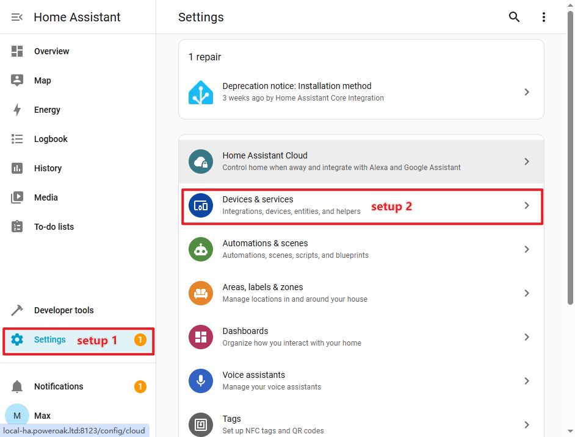
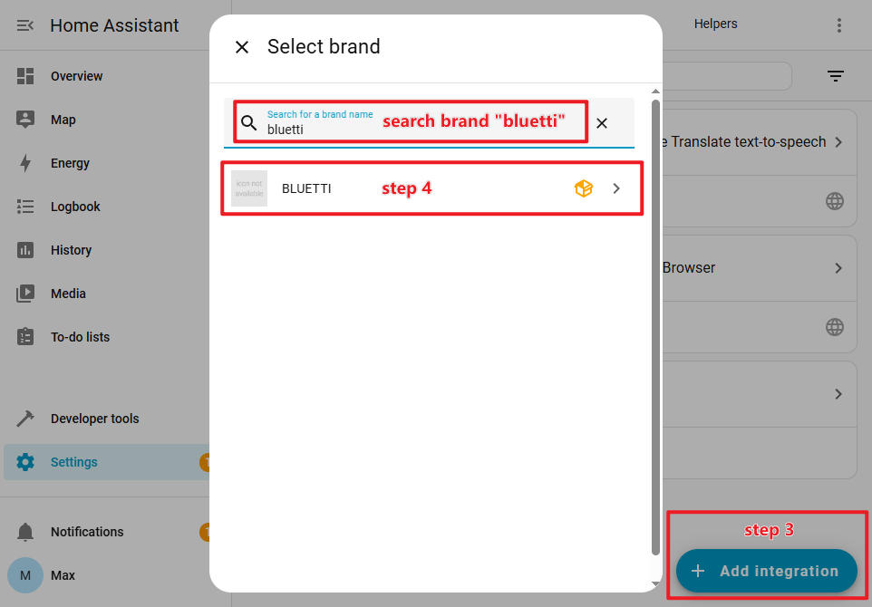
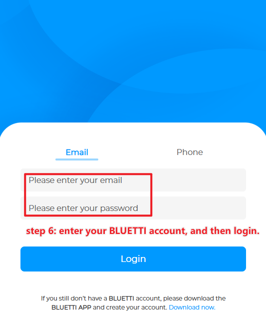
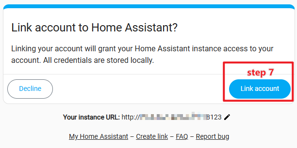
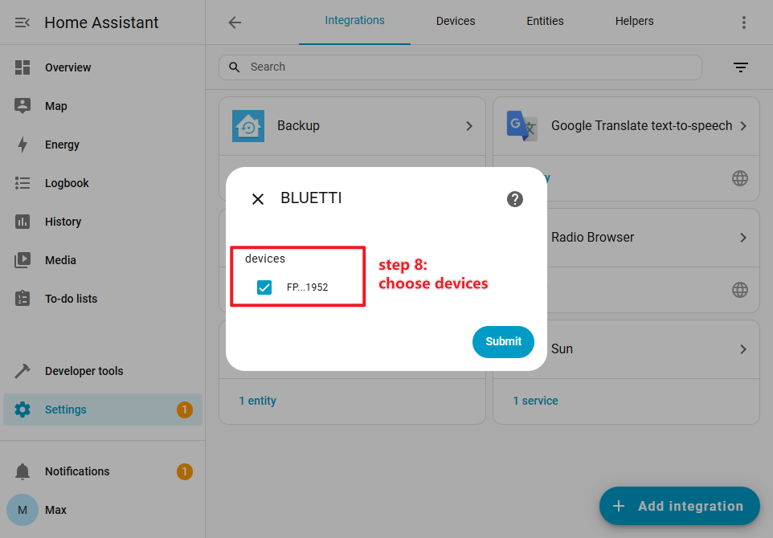
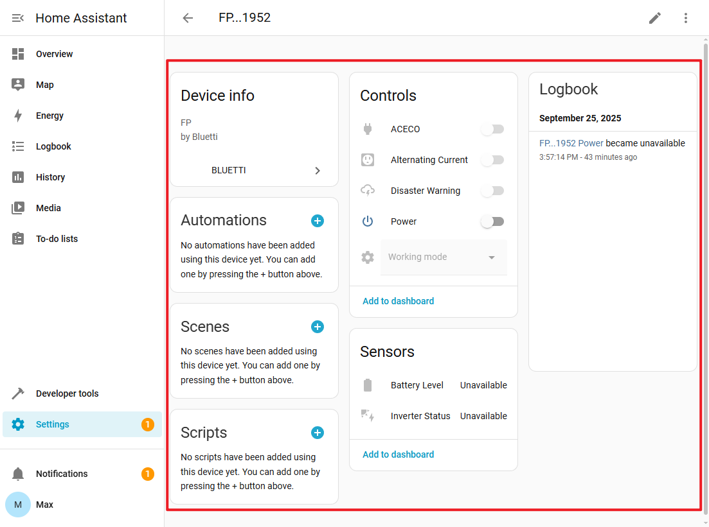

# Intégration BLUETTI pour Home Assistant

[🇨🇳 简体中文](./README_zh.md) | [🇩🇪 Allemand](./README_de.md) | [🇫🇷 Français](./README_fr.md) | [🇬🇧 Anglais](./README.md) |
[🇳🇱 Néerlandais](./README_nl.md) | [🇺🇦 Ukrainien](./README_uk.md)

L’intégration BLUETTI Power Station est un composant intégré à Home Assistant
supporté officiellement par BLUETTI. Elle vous permet d’utiliser les appareils
BLUETTI Smart Power Station dans Home Assistant.

Le dépôt GitHub de l’intégration est :
[https://github.com/bluetti-official/bluetti-home-assistant](https://github.com/bluetti-official/bluetti-home-assistant).

## ✨ Fonctionnalités

- ✅ Interrupteur d’alimentation
- ✅ État de l’onduleur
- ✅ État de charge de la batterie (SOC)
- ✅ Interrupteur CA
- ✅ Interrupteur CC
- ✅ Interrupteur de l’unité principale
- ✅ AC ECO
- ✅ DC ECO
- ✅ Commutation de mode de fonctionnement : Backup, Autoconsommation, Pic et Creux
- ✅ Mode veille
- ✅ Puissance d’entrée PV
- ✅ Puissance d’entrée réseau
- ✅ Puissance de sortie CA
- ✅ Puissance de sortie CC

## 🎮 Liste des stations d’énergie prises en charge

> [!NOTE]
>
> D’autres modèles de stations d’énergie seront ajoutés à l’avenir.

|      Modèle de station d’énergie      |          Nom commercial          | État de l’onduleur | SOC batterie | Interrupteur CA | Interrupteur CC | Interrupteur d’alimentation | AC ECO | DC ECO | Changement de mode de fonctionnement | Mode veille | Puissance d’entrée PV | Puissance d’entrée réseau | Puissance de sortie CA | Puissance de sortie CC |
|:-------------------------------------:|:--------------------------------:|:-------------------:|:------------:|:--------------:|:--------------:|:----------------------------:|:------:|:------:|:------------------------------------:|:-----------:|:---------------------:|:-------------------------:|:-----------------------:|:-----------------------:|
|                 AP300                  |             Apex 300             |                     |      ✅      |      ✅       |               |                              |   ✅    |        |                  ✅                   |     ✅      |           ✅           |            ✅            |           ✅            |           ✅            |
|                 EL300                  |         Elite 300, AORA 300      |                     |      ✅      |      ✅       |      ✅       |                              |   ✅    |   ✅    |                  ✅                   |     ✅      |           ✅           |            ✅            |           ✅            |           ✅            |
|             EL320, AORA320             |         Elite 320, AORA 320      |                     |      ✅      |      ✅       |      ✅       |                              |   ✅    |   ✅    |                  ✅                   |     ✅      |           ✅           |            ✅            |           ✅            |           ✅            |
|                 EL400                  |             Elite 400            |                     |      ✅      |      ✅       |      ✅       |                              |   ✅    |   ✅    |                  ✅                   |     ✅      |           ✅           |            ✅            |           ✅            |           ✅            |
|                 EP13K                  |               EP13k              |       ✅            |      ✅      |               |               |             ✅              |        |        |                  ✅                   |            |                       |                           |                         |                         |
|                 EP2000                 |               EP200              |       ✅            |      ✅      |               |               |             ✅              |        |        |                  ✅                   |            |                       |                           |                         |                         |
|                  EP6K                  |               EP6k               |       ✅            |      ✅      |               |               |             ✅              |        |        |                  ✅                   |            |                       |                           |                         |                         |
|                 EP760                  |               EP760              |       ✅            |      ✅      |               |               |             ✅              |        |        |                                      |            |                       |                           |                         |                         |
|                EP500Pro                |             EP500Pro             |                     |      ✅      |      ✅       |      ✅       |                              |        |        |                  ✅                   |            |           ✅           |            ✅            |           ✅            |           ✅            |
|                   FP                   |          Fridge Product         |       ✅            |      ✅      |      ✅       |      ✅       |                              |   ✅    |   ✅    |                  ✅                   |     ✅      |                       |                           |                         |                         |
|      PR100V2, EL100V2, AORA100V2      | Premium 100 V2, Elite 100 V2, AORA 100 V2 |                |      ✅      |      ✅       |      ✅       |                              |   ✅    |   ✅    |                  ✅                   |     ✅      |           ✅           |            ✅            |           ✅            |           ✅            |
| PR200V2, Elite 200 V2, AORA200       | Premium 200 V2, Elite 200 V2, AORA 200 V2 |                |      ✅      |      ✅       |      ✅       |                              |   ✅    |   ✅    |                  ✅                   |     ✅      |           ✅           |            ✅            |           ✅            |           ✅            |
|        PR30V2, EL30V2                 | Premium 30 V2, Elite 30 V2, AORA 30 V2   |                |      ✅      |      ✅       |      ✅       |                              |   ✅    |   ✅    |                  ✅                   |     ✅      |           ✅           |            ✅            |           ✅            |           ✅            |
|                  RV5                   |                RV5               |       ✅            |      ✅      |      ✅       |      ✅       |                              |        |        |                  ✅                   |     ✅      |           ✅           |            ✅            |           ✅            |           ✅            |
|          Balco260, Balco500          |         Balco260, Balco500       |       ✅            |      ✅      |      ✅       |               |                              |        |        |                  ✅                   |            |           ✅           |            ✅            |           ✅            |                         |
|              AC300, AC500             |            AC300, AC500          |                     |      ✅      |      ✅       |      ✅       |                              |        |        |                  ✅                   |            |           ✅           |            ✅            |           ✅            |           ✅            |
|            AC200PL, AC200L            |           AC200PL, AC200L       |                     |      ✅      |      ✅       |      ✅       |                              |   ✅    |   ✅    |                  ✅                   |            |           ✅           |            ✅            |           ✅            |           ✅            |

## 📦 Installation de l’intégration

Il existe deux façons d’installer l’intégration BLUETTI Power Station.

### Installation manuelle

1. Ouvrez le répertoire de configuration de Home Assistant.

   ```bash
   cd /<ha workspaces>/core/config/custom_components
   ```

2. Clonez le dépôt GitHub de l’intégration BLUETTI Power Station.

   ```bash
   git clone https://github.com/bluetti-official/bluetti-home-assistant.git
   ```

3. Ou téléchargez l’archive intégrée et extrayez-la dans le répertoire des
   intégrations personnalisées de Home Assistant :

   ```bash
   unzip xxx.zip -d /<ha workspaces>/core/config/custom_components/bluetti
   ```

4. Redémarrez votre système Home Assistant.

### Installation via HACS

Comme l’intégration BLUETTI Power Station n’a pas encore été soumise au dépôt
HACS officiel, il est nécessaire d’ajouter manuellement un dépôt personnalisé.
HACS est lui-même un module complémentaire de Home Assistant (les utilisateurs
doivent d’abord l’installer), similaire à une boutique d’applications. Grâce à
cette boutique, d’autres intégrations tierces peuvent être installées.

1. Suivez les étapes « HACS -> Intégration -> Dépôt personnalisé » (situé dans
   le coin supérieur droit de la page).

2. Ajoutez le dépôt et sélectionnez le type :
   - **Dépôt :**
     [https://github.com/bluetti-official/bluetti-home-assistant.git](https://github.com/bluetti-official/bluetti-home-assistant.git)
   - **Type :** Intégration

3. Puis, sur la page « Intégration » de HACS, vous verrez l’intégration
   « BLUETTI ». Cliquez pour l’installer.

4. Enfin, redémarrez votre système Home Assistant.

## ⚙️ Configuration de l’intégration

1. Suivez les étapes « Paramètres -> Appareils et services », puis ouvrez la
   page « Liste des intégrations ».

   

2. Cliquez sur le bouton « Ajouter une intégration », puis recherchez le mot-clé
   de marque « bluetti » ; sélectionnez l’intégration « BLUETTI » pour
   poursuivre avec la connexion par autorisation OAuth.

   

3. Vous devez accepter que Home Assistant puisse accéder à votre compte BLUETTI
   et établir une connexion avec le service cloud BLUETTI.

   

4. Saisissez votre compte BLUETTI pour autoriser et vous connecter.

   

5. Vous devez accepter que Home Assistant se connecte à votre compte BLUETTI.

   

6. Sélectionnez les appareils BLUETTI que vous souhaitez utiliser et gérer dans
   Home Assistant.

   
   

## ❓ FAQ

### Introuvable « BLUETTI Integration » après l’installation ?

Veuillez vérifier si le chemin des composants personnalisés est correct et si
le système Home Assistant a bien été redémarré.

### Toujours hors ligne ou échec de connexion au serveur BLUETTI ?

Veuillez vérifier le réseau, les ports et le pare-feu pour vous assurer que
Home Assistant peut accéder aux appareils de la station d’énergie.

### Comment mettre à jour l’intégration BLUETTI ?

1. Ouvrez la page de gestion HACS pour effectuer la mise à jour.
2. Mettez à jour avec git :

   ```bash
   cd /<ha workspaces>/config/custom_components/bluetti
   git pull
   ```

## Avis

### Le mode Autoconsommation de Balco260 nécessite une connexion au compteur électrique

## 📮 Support et retours

💬 Vous avez un problème ou une suggestion ? Ouvrez un ticket sur GitHub :
[https://github.com/bluetti-official/bluetti-home-assistant/issues](https://github.com/bluetti-official/bluetti-home-assistant/issues)
