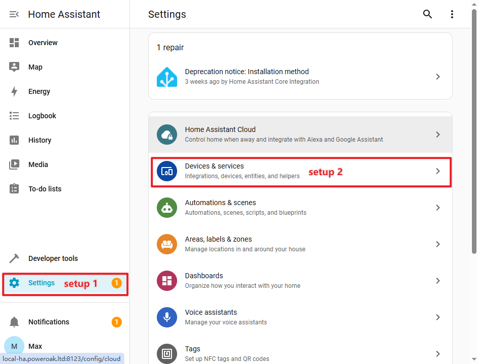
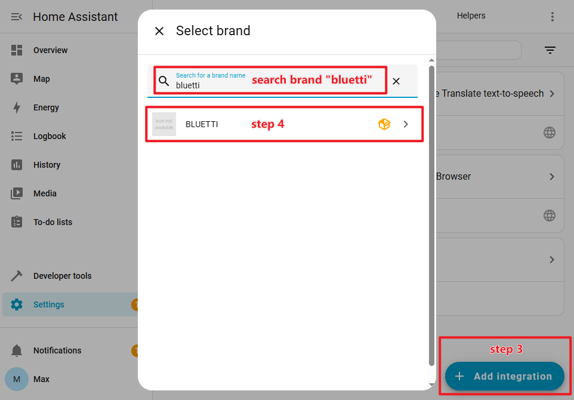
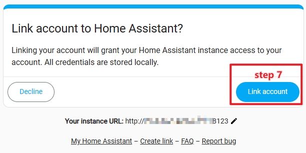
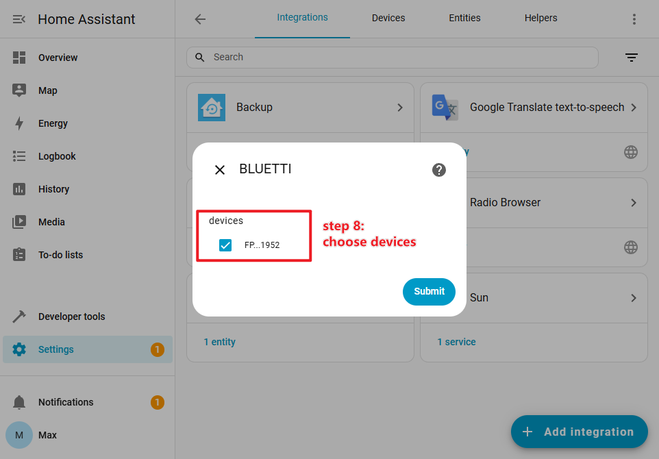
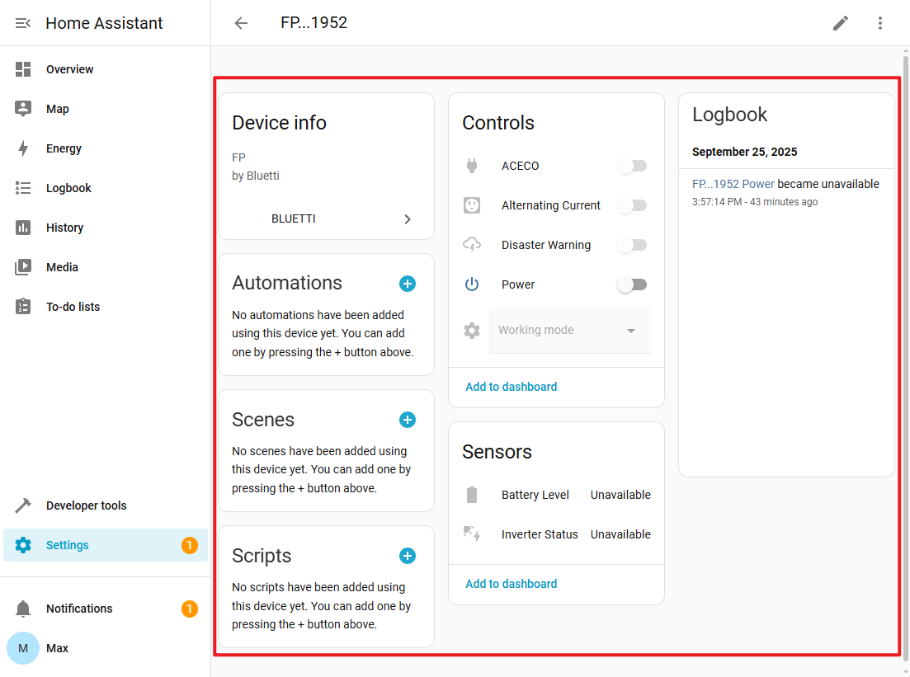

# BLUETTI-integratie voor Home Assistant

[🇨🇳 简体中文](./README_zh.md) | [🇩🇪 German](./README_de.md) | [🇬🇧 English](./README.md) | 
[🇳🇱 Dutch](./README_nl.md) | [🇺🇦 Ukrainian](./README_uk.md) | 

De **BLUETTI powerstation-integratie** is een geïntegreerde component van Home
Assistant, officieel ondersteund door BLUETTI. Hiermee kun je BLUETTI slimme
powerstations gebruiken binnen Home Assistant.

De GitHub-repository van de integratie is:
[https://github.com/bluetti-official/bluetti-home-assistant](https://github.com/bluetti-official/bluetti-home-assistant).

## ✨ Functies

- ✅ Status van de omvormer
- ✅ Batterijlading (SOC)
- ✅ AC-schakelaar
- ✅ DC-schakelaar
- ✅ Hoofdschakelaar
- ✅ AC ECO-modus
- ✅ DC ECO-modus
- ✅ Werkmodusschakelaar: noodstroom, zelfverbruik, piek- en daluren
- ✅ Slaap Modus
- ✅ PV-ingangsvermogen
- ✅ Net-ingangsvermogen
- ✅ AC-uitgangsvermogen
- ✅ DC-uitgangsvermogen

## 🎮 Ondersteunde powerstationmodellen

> [!NOTE]
>
> Meer powerstationmodellen zullen in de toekomst worden toegevoegd.

|      Powerstationmodel       |               productnaam               | Omvormerstatus  | Batterij-SOC | AC-schakelaar | DC-schakelaar | Hoofdschakelaar | AC ECO | DC ECO | Werkmodusschakelaar | Slaap Modus | PV-ingangsvermogen | Net-ingangsvermogen | AC-ingangsvermogen | DC-ingangsvermogen |
|:----------------------------:|:---------------------------------------:|:---------------:|:------------:|:-------------:|:-------------:|:---------------:|:------:|:------:|:-------------------:|:-----------:|:------------------:|:-------------------:|:------------------:|:------------------:| 
|            AP300             |                Apex 300                 |                 |      ✅       |       ✅       |               |                 |   ✅    |        |          ✅          |      ✅      |         ✅          |          ✅          |         ✅          |         ✅          |
|            EL300             |           Elite 300,AORA 300            |                 |      ✅       |       ✅       |       ✅       |                 |   ✅    |   ✅    |          ✅          |      ✅      |         ✅          |          ✅          |         ✅          |         ✅          |
|        EL320,AORA320         |           Elite 320,AORA 320            |                 |      ✅       |       ✅       |       ✅       |                 |   ✅    |   ✅    |          ✅          |      ✅      |         ✅          |          ✅          |         ✅          |         ✅          |
|            EL400             |                Elite 400                |                 |      ✅       |       ✅       |       ✅       |                 |   ✅    |   ✅    |          ✅          |      ✅      |         ✅          |          ✅          |         ✅          |         ✅          |
|            EP13K             |                  EP13k                  |        ✅        |      ✅       |               |               |        ✅        |        |        |          ✅          |             |                    |                     |                    |                    |
|            EP2000            |                  EP200                  |        ✅        |      ✅       |               |               |        ✅        |        |        |          ✅          |             |                    |                     |                    |                    |
|             EP6K             |                  EP6k                   |        ✅        |      ✅       |               |               |        ✅        |        |        |          ✅          |             |                    |                     |                    |                    |
|            EP760             |                  EP760                  |        ✅        |      ✅       |               |               |        ✅        |        |        |                     |             |                    |                     |                    |                    |
|           EP500Pro           |                EP500Pro                 |                 |      ✅       |       ✅       |       ✅       |                 |        |        |          ✅          |             |         ✅          |          ✅          |         ✅          |         ✅          |
|              FP              |             Fridge Product              |        ✅        |      ✅       |       ✅       |       ✅       |                 |   ✅    |   ✅    |          ✅          |      ✅      |                    |                     |                    |                    |
|  PR100V2,EL100V2,AORA100V2   | Premium 100 V2,Elite 100 V2,AORA 100 V2 |                 |      ✅       |       ✅       |       ✅       |                 |   ✅    |   ✅    |          ✅          |      ✅      |         ✅          |          ✅          |         ✅          |         ✅          |
| PR200V2,Elite 200 V2,AORA200 | Premium 200 V2,Elite 200 V2,AORA 200 V2 |                 |      ✅       |       ✅       |       ✅       |                 |   ✅    |   ✅    |          ✅          |      ✅      |         ✅          |          ✅          |         ✅          |         ✅          |
|        PR30V2,EL30V2         |  Premium 30 V2,Elite 30 V2,AORA 30 V2   |                 |      ✅       |       ✅       |       ✅       |                 |   ✅    |   ✅    |          ✅          |      ✅      |         ✅          |          ✅          |         ✅          |         ✅          |
|             RV5              |                   RV5                   |        ✅        |      ✅       |       ✅       |       ✅       |                 |        |        |          ✅          |      ✅      |         ✅          |          ✅          |         ✅          |         ✅          |
|      Balco260,Balco500       |            Balco260,Balco500            |        ✅        |      ✅       |       ✅       |               |                 |        |        |          ✅          |             |         ✅          |          ✅          |         ✅          |                    |
|         AC300,AC500          |               AC300,AC500               |                 |      ✅       |       ✅       |       ✅       |                 |        |        |          ✅          |             |         ✅          |          ✅          |         ✅          |         ✅          |
|        AC200PL,AC200L        |             AC200PL,AC200L              |                 |      ✅       |       ✅       |       ✅       |                 |   ✅    |   ✅    |          ✅          |             |         ✅          |          ✅          |         ✅          |         ✅          |

## 📦 Installatie van de integratie

Er zijn twee manieren om de `BLUETTI powerstation-integratie` te installeren:

### Handmatige installatie

1. Ga naar de configuratiemap van `Home Assistant`:

   ```bash
   cd /<ha workspaces>/core/config/custom_components
   ```

2. Clone de GitHub-repository van de `BLUETTI powerstation-integratie`:

   ```bash
   git clone https://github.com/bluetti-official/bluetti-home-assistant.git
   ```

3. Of download het zip-bestand van de integratie en pak het uit in de map
   `custom_components` van `Home Assistant`:

   ```bash
   unzip xxx.zip -d /<ha workspaces>/core/config/custom_components/bluetti
   ```

4. Start vervolgens **Home Assistant** opnieuw op.

### Installatie via HACS

De **BLUETTI powerstation-integratie** is nog niet opgenomen in de officiële
[HACS-repository](https://github.com/hacs/integration). Daarom moet je deze
handmatig toevoegen als een **aangepaste repository**.

**HACS** (Home Assistant Community Store) is een uitbreiding voor Home Assistant
die fungeert als een soort **app store** voor integraties van derden. Zorg er
dus eerst voor dat HACS is geïnstalleerd voordat je aangepaste repositories kan
toevoegt.

#### Stappenplan

1. Open **HACS → Integraties → Aangepaste repository** (rechtsboven op de
   pagina).

2. Voeg de volgende repository toe en selecteer het juiste type:
   - **Repository:**
     [https://github.com/bluetti-official/bluetti-home-assistant.git](https://github.com/bluetti-official/bluetti-home-assistant.git)
   - **Type:** Integration

3. Ga daarna naar de pagina **Integraties** in HACS. De `BLUETTI`-integratie
   verschijnt nu in de lijst. Klik om te installeren.

4. Start vervolgens **Home Assistant** opnieuw op.

## ⚙️ Configuratie van de integratie

1. Ga naar “Instellingen → Apparaten en diensten” om de lijst met integraties te
   openen.

   

2. Klik op “Integratie toevoegen”, zoek naar het merk `bluetti`, en selecteer de
   `BLUETTI`-integratie om de OAuth-autorisatie te starten.

   

3. Je moet toestemming geven zodat `Home Assistant` toegang krijgt tot je
   BLUETTI-account en verbinding kan maken met de BLUETTI-cloudservice.

   

4. Voer je BLUETTI-accountgegevens in om in te loggen en te autoriseren.

   

5. Bevestig dat `Home Assistant` je BLUETTI-account mag koppelen.

   

6. Selecteer vervolgens de BLUETTI-apparaten die je wilt gebruiken en beheren in
   Home Assistant.

   
   

## ❓ Veelgestelde vragen (FAQ)

### De `BLUETTI-integratie` wordt niet gevonden na installatie

Controleer of het pad `custom_components` correct is en of het
`Home Assistant`-systeem opnieuw is opgestart.

### De integratie blijft offline of maakt geen verbinding met de BLUETTI-server

Controleer de **netwerkverbinding**, **poorten** en **firewall** om zeker te
zijn dat `Home Assistant` toegang heeft tot de BLUETTI-powerstations.

### Hoe update ik de `BLUETTI-integratie`?

1. Voer de update uit via de HACS-beheerpagina.
2. Of update via `git`:

   ```bash
   cd /<ha workspaces>/config/custom_components/bluetti
   git pull
   ```

## Kennisgeving

### Voor de Balco260 zelfverbruikmodus is een elektriciteitsmeter nodig.

## 📮 Ondersteuning & feedback

💬 Heb je problemen of suggesties? Maak een issue aan op GitHub:
[https://github.com/bluetti-official/bluetti-home-assistant/issues](https://github.com/bluetti-official/bluetti-home-assistant/issues)
