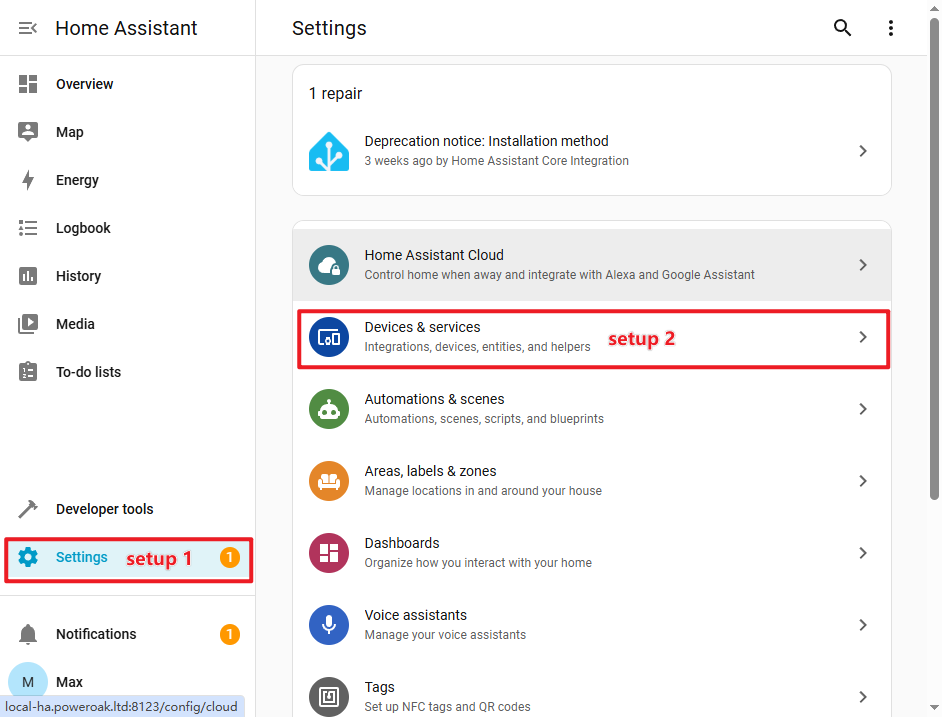
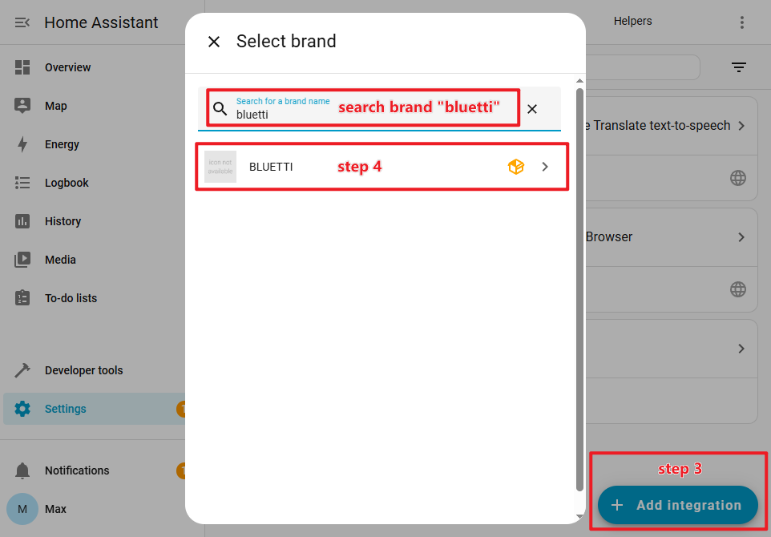
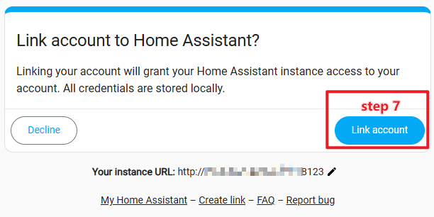
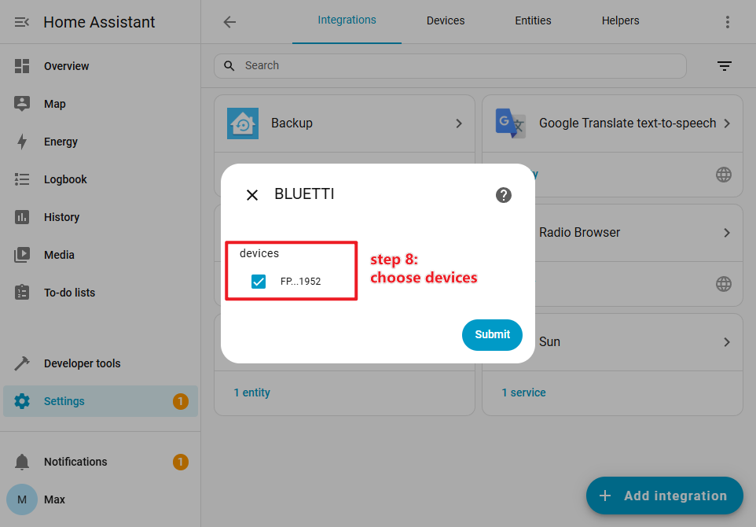
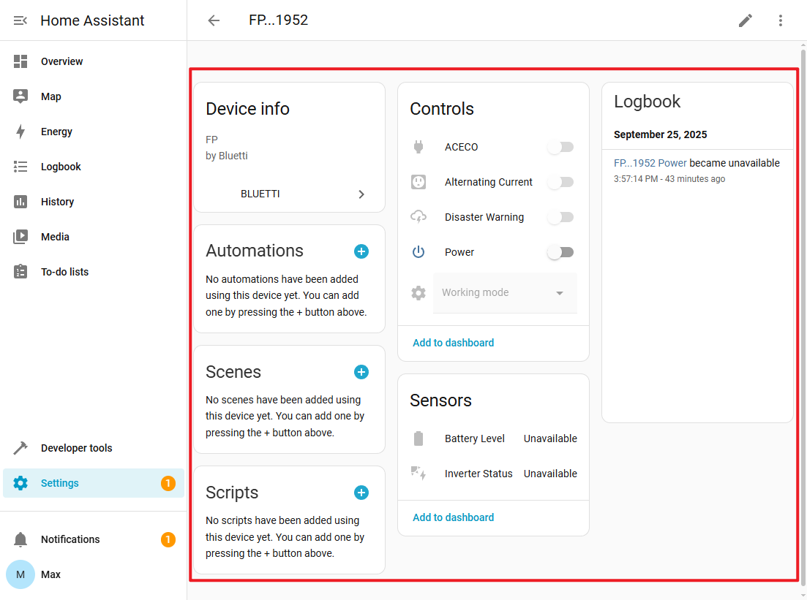

# BLUETTI储能HA集成

[🇨🇳 简体中文](./README_zh.md) | [🇩🇪 German](./README_de.md) | [🇫🇷 Français](./README_fr.md) | [🇬🇧 English](./README.md) | [🇳🇱 Dutch](./README_nl.md) | [🇺🇦 Ukrainian](./README_uk.md)

BLUETTI储能集成是一个由BLUETTI官方提供的Home Assistant集成插件，支持在Home Assistant系统中使用您的BLUETTI智能储能设备。2026年8月，项目正式确立"官方版 + 社区版"双轨并行的项目维护模式。社区版派生自官方版代码库，保持关联但定位不同，用户可按需选择。两个版本的核心差异对比如下：

|             | 官方版 \(Official\) | 社区版 \(Community\) |
| ----------- | ------------------ | -------------------- |
| **仓库地址** |[https://github.com/bluetti-official/bluetti-home-assistant](https://github.com/bluetti-official/bluetti-home-assistant)|[https://github.com/bluetti-community/bluetti-home-assistant](https://github.com/bluetti-community/bluetti-home-assistant)|
| **维护主体** | BLUETTI官方团队 | 社区开发者主导 |
| **发布节奏** | 保守，受产品规划及内部合规审计约束 | 快速迭代，接纳更多功能增强与社区PR |
| **功能范围** | 以稳定、合规为优先，新功能需经内部审核后发布 | 更灵活，可先行实验新功能与新设备适配 |
| **设备支持** | 视BLUETTI产品规划 | 同步官方设备支持，并接纳社区贡献的设备适配 |
| **Bug修复**  | 官方修复并随版本统一发布 | 社区活跃修复 |
| **长期定位** | BLUETTI官方唯一认可仓库，面向追求稳定的用户 | 活跃开发主阵地，面向追求更高自由度的用户 |

> ℹ️ 官方版和社区版的配置方式及账号授权流程一致，切换版本不会丢失设备、配置信息等数据。

## ✨ 功能特性

- ✅ 逆变器状态（Inverter Status）
- ✅ 电量SOC（Battery state of charge）
- ✅ AC开关（AC Switch）
- ✅ DC开关（DC Switch）
- ✅ 整机电源开关（Main unit power switch）
- ✅ AC ECO
- ✅ DC ECO
- ✅ 工作模式切换（Work mode switch）：自发自用，备用电源，削峰填谷
- ✅ 休眠模式
- ✅ 光伏输入功率
- ✅ 电网输入功率
- ✅ AC输出功率
- ✅ DC输出功率

## 🎮 机型支持清单
> [!NOTE]
>
> 后续将支持更多型号的储能电站。

|         型号         |      产品名称      |      云端控制      |      蓝牙控制      |      逆变器状态      |    电量SOC     |    AC开关    |     DC开关     |   整机电源开关   |  AC ECO  |  DC ECO  |   工作模式切换   |   休眠模式   |  光伏输入功率   |  电网输入功率   |  AC输出功率   | DC输出功率  |
|:------------------:|:--------------:|:---------------:|:---------------:|:---------------:|:------------:|:----------:|:------------:|:----------:|:--------:|:--------:| :----------: |:--------:|:---------:|:---------:|:---------:|:-------:|
|       AC200L       |   AC200L       |       ✅       |      ✅      |                 |       ✅        |     ✅     |      ✅     |             |   ✅    |   ✅    |        ✅         |            |       ✅        |        ✅         |        ✅        |        ✅        |
|      AC200PL       |    AC200PL     |       ✅       |      ✅      |                 |       ✅        |     ✅     |      ✅     |             |   ✅    |   ✅    |        ✅         |            |       ✅        |        ✅         |        ✅        |        ✅        |
|       AC300        |     AC300      |       ✅       |             |                 |       ✅        |     ✅     |      ✅     |             |        |        |        ✅         |            |       ✅        |        ✅         |        ✅        |        ✅        |
|       AC500        |     AC500      |       ✅       |             |                 |       ✅        |     ✅     |      ✅     |             |        |        |        ✅         |            |       ✅        |        ✅         |        ✅        |        ✅        |
|       AP200        |    Apex 200    |       ✅       |      ✅      |                 |      ✅         |     ✅     |           |             |   ✅    |        |        ✅         |     ✅      |       ✅        |        ✅         |        ✅        |        ✅        |
|       AP300        |    Apex 300    |       ✅       |      ✅      |                 |       ✅        |     ✅     |           |             |   ✅    |        |        ✅         |     ✅      |       ✅        |        ✅         |        ✅        |        ✅        |
|      AP300V2       |  Apex 300 V2   |       ✅       |      ✅      |                 |       ✅        |     ✅     |           |             |   ✅    |        |        ✅         |     ✅      |       ✅        |        ✅         |        ✅        |        ✅        |
|      AORA30V2      |   AORA 30 V2   |       ✅       |      ✅      |                 |       ✅        |     ✅     |     ✅     |             |   ✅    |   ✅    |        ✅         |     ✅      |       ✅        |        ✅         |        ✅        |        ✅        |
|     AORA100V2      |  AORA 100 V2   |       ✅       |      ✅      |                 |       ✅        |     ✅     |     ✅     |             |   ✅    |   ✅    |        ✅         |     ✅      |       ✅        |        ✅         |        ✅        |        ✅        |
|      AORA200       |    AORA 200    |       ✅       |      ✅      |                 |       ✅        |     ✅     |     ✅     |             |   ✅    |   ✅    |        ✅         |     ✅      |       ✅        |        ✅         |        ✅        |        ✅        |
|     AORA200V2      |  AORA 200 v2   |       ✅       |      ✅      |                 |       ✅        |     ✅     |     ✅     |             |   ✅    |   ✅    |        ✅         |     ✅      |       ✅        |        ✅         |        ✅        |        ✅        |
|      AORA300       |    AORA 300    |       ✅       |      ✅      |                 |       ✅        |     ✅     |     ✅     |             |   ✅    |   ✅    |        ✅         |     ✅      |       ✅        |        ✅         |        ✅        |        ✅        |
|      AORA320       |    AORA 320    |       ✅       |      ✅      |                 |       ✅        |     ✅     |     ✅     |             |   ✅    |   ✅    |        ✅         |     ✅      |       ✅        |        ✅         |        ✅        |        ✅        |
|      Balco260      |    Balco260    |       ✅       |      ✅      |        ✅        |       ✅        |     ✅     |           |             |        |        |        ✅         |            |       ✅        |        ✅         |        ✅        |                 |
|      Balco500      |    Balco500    |       ✅       |      ✅      |        ✅        |       ✅        |     ✅     |           |             |        |        |        ✅         |            |       ✅        |        ✅         |        ✅        |                 |
|        EB3A        |      EB3A      |               |      ✅      |                 |       ✅        |     ✅     |      ✅     |             |   ✅    |   ✅    |                  |            |       ✅        |        ✅         |        ✅        |        ✅        |
|       EL300        |   Elite 300    |       ✅       |      ✅      |                 |       ✅        |     ✅     |     ✅     |             |   ✅    |   ✅    |        ✅         |     ✅      |       ✅        |        ✅         |        ✅        |        ✅        |
|       EL320        |   Elite 320    |       ✅       |      ✅      |                 |       ✅        |     ✅     |     ✅     |             |   ✅    |   ✅    |        ✅         |     ✅      |       ✅        |        ✅         |        ✅        |        ✅        |
|       EL400        |   Elite 400    |       ✅       |      ✅      |                 |       ✅        |     ✅     |     ✅     |             |   ✅    |   ✅    |        ✅         |     ✅      |       ✅        |        ✅         |        ✅        |        ✅        |
|       EL30V2       |  Elite 30 V2   |       ✅       |      ✅      |                 |       ✅        |     ✅     |     ✅     |             |   ✅    |   ✅    |        ✅         |     ✅      |       ✅        |        ✅         |        ✅        |        ✅        |
|      EL100V2       |  Elite 100 V2  |       ✅       |      ✅      |                 |       ✅        |     ✅     |     ✅     |             |   ✅    |   ✅    |        ✅         |     ✅      |       ✅        |        ✅         |        ✅        |        ✅        |
|    Elite 200 V2    |  Elite 200 V2  |       ✅       |      ✅      |                 |       ✅        |     ✅     |     ✅     |             |   ✅    |   ✅    |        ✅         |     ✅      |       ✅        |        ✅         |        ✅        |        ✅        |
|       EP13K        |     EP13k      |       ✅       |             |        ✅        |       ✅        |           |           |      ✅      |        |        |        ✅         |            |                |                  |                 |                 |
|       EP2000       |     EP200      |       ✅       |             |        ✅        |       ✅        |           |           |      ✅      |        |        |        ✅         |            |                |                  |                 |                 |
|        EP6K        |      EP6k      |       ✅       |             |        ✅        |       ✅        |           |           |      ✅      |        |        |        ✅         |            |                |                  |                 |                 |
|       EP760        |     EP760      |       ✅       |             |        ✅        |       ✅        |           |           |      ✅      |        |        |                  |            |                |                  |                 |                 |
|      EP500Pro      |    EP500Pro    |       ✅       |             |                 |       ✅        |     ✅     |      ✅     |             |        |        |        ✅         |            |       ✅        |        ✅         |        ✅        |        ✅        |
|         FP         | Fridge Product |       ✅       |      ✅      |        ✅        |       ✅        |     ✅     |     ✅     |             |   ✅    |   ✅    |        ✅         |     ✅      |                |                  |                 |                 |
|        HA1         |     Hub A1     |       ✅       |             |                 |       ✅        |     ✅     |           |             |   ✅    |        |        ✅         |     ✅      |       ✅        |        ✅         |        ✅        |        ✅        |
|      PR100V2       | Premium 100 V2 |       ✅       |      ✅      |                 |       ✅        |     ✅     |     ✅     |             |   ✅    |   ✅    |        ✅         |     ✅      |       ✅        |        ✅         |        ✅        |        ✅        |
|      PR200V2       | Premium 200 V2 |       ✅       |      ✅      |                 |       ✅        |     ✅     |     ✅     |             |   ✅    |   ✅    |        ✅         |     ✅      |       ✅        |        ✅         |        ✅        |        ✅        |
|       PR30V2       | Premium 30 V2  |       ✅       |      ✅      |                 |       ✅        |     ✅     |     ✅     |             |   ✅    |   ✅    |        ✅         |     ✅      |       ✅        |        ✅         |        ✅        |        ✅        |
|        RV5         |      RV5       |       ✅       |      ✅      |        ✅        |       ✅        |     ✅     |     ✅     |             |        |        |        ✅         |     ✅      |       ✅        |        ✅         |        ✅        |        ✅        |


## 📦 安装方法

### 方法A：手动安装

1. 进入Home Assistant配置目录：

    ```bash
    cd /<ha workspaces>/config/custom_components
    ```

2. 克隆BLUETTI储能集成github仓库：

    ```bash
    git clone https://github.com/bluetti-official/bluetti-home-assistant.git
    ```

3. 或者下载集成的zip压缩包，并解压到：

    ```bash
    unzip xxx.zip -d /<ha workspaces>/core/config/custom_components/bluetti
    ```

4. 重启Home Assistant系统。

<hr/>

### 方法B：通过HACS安装

由于目前Bluetti home assistant集成尚未提交至 HACS 官方仓库，需要手动添加自定义仓库。 HACS 本身是一个 Home Assistant 插件（用户需要先安装 HACS），类似应用市场，通过该应用市场来安装其他三方集成。

1. 打开 HACS → 集成 → 自定义仓库（右上角）

2. 添加仓库地址：

    ```shell
    https://github.com/bluetti-official/bluetti-home-assistant.git
    ```
    类型选择：Integration

3. 接着在 HACS 的“集成”页面，就能看到Bluetti的插件，点击安装。

4. 安装后，重启Home Assistant。

## ⚙️ 安装集成

### 通过界面添加集成

1. 进入`Home Assistant` → 设置 → 设备与服务。

   

2. 点击“添加集成”按钮，然后搜索品牌关键词`bluetti`；选择`BLUETTI`集成进行下一步的OAUTH授权登录。

   

3. 您必须同意`Home Assistant`访问您的BLUETTI账号并与BLUETTI云服务建立联系。

   

4. 输入您的BLUETTI账号以进行授权登录。

   

5. 您必须同意`Home Assistant`链接使用您的BLUETTI账号。

   

6. 选择需要在`Home Assistant`中使用和管理的BLUETTI电站设备。

   
   

## 🗑️ 移除集成
1. 进入 **设置 → 设备与服务**，打开`BLUETTI`集成卡片，点击集成条目上的三点菜单并选择 **删除**。这将从Home Assistant中移除该配置条目及其关联的设备和实体。
2. 删除集成文件：
   - **通过HACS安装**：进入 **HACS → 集成**，打开`BLUETTI`，选择 **移除**。
   - **手动安装**：从你的Home Assistant配置目录中删除`custom_components/bluetti`文件夹。
3. 重启Home Assistant以完成移除。
4. (可选)如果你不再希望Home Assistant访问你的BLUETTI账号，请在BLUETTI账号的 **已连接应用** 设置中撤销授权。

## ❓ 常见问题(FAQ)

### 没有显示BLUETTI集成？

检查`custom_components`路径是否正确，并确认是否已经重启`Home Assistant`系统。

### 设备不在线、设备联网失败

请检查网络、端口、防火墙，确保`Home Assistant`能访问储能设备。

### 如何更新BLUETTI集成？

1. 进入HACS管理页面进行更新。
2. 借助git进行更新

    ```bash
    cd /<ha workspaces>/config/custom_components/bluetti
    git pull
    ```

## 注意

### Balco260 自发自用模式需要接入电表

## 📮 支持 & 反馈

- GitHub Issues:
  [https://github.com/bluetti-official/bluetti-home-assistant/issues](https://github.com/bluetti-official/bluetti-home-assistant/issues)
